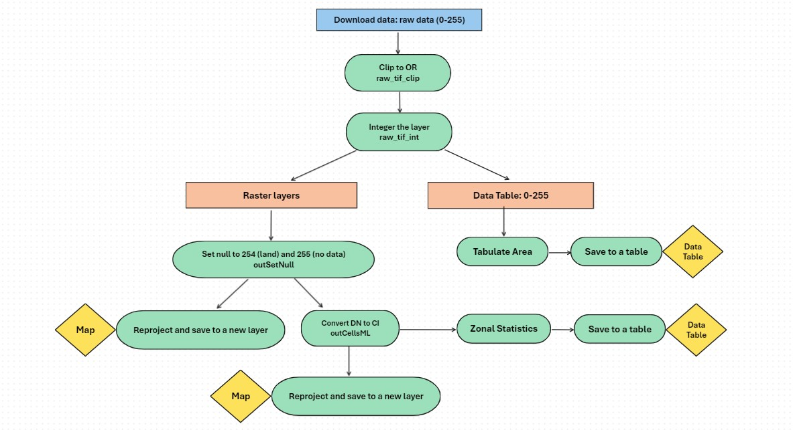

## Import data
```{r}
library(dplyr)
library(reticulate)
Sys.setenv(RETICULATE_PYTHON = "C:\\Program Files\\ArcGIS\\Pro\\bin\\Python\\envs\\arcgispro-py3\\python.exe")
Sys.setenv(PROJ_LIB = "C:\\Users\\ygrund\\AppData\\Local\\R\\win-library\\4.3\\PROJ\\proj")
# Sys.setlocale(locale = "English_United States.1252")
Sys.setlocale("LC_ALL", "en_US.UTF-8")
data_path <- "//deqhq1/WQ-Share/Harmful Algal Blooms Coordination Team/HAB_Shiny_app/data/"
data <-  readxl::read_excel(paste0(data_path,"HAB_resolvablelakes_2024.xlsx"))
dates <- readxl::read_excel("./data/calendar-dates.xlsx")
resolvable_lakes <- readxl::read_excel("./data/Resolvable_Lakes.xlsx")

```

## Step 1. Download data from NASA's data site.

```{r OceanData}
# # Download data from OceanData site - not working
# day_start <- "2024081"
# 
# library(httr)
# 
# # Function to create a custom session for authentication
# session <- function(username, password) {
#   httr::authenticate(username, password)
# }
# 
# # Define username and password
# username <- "ygrund"
# password <- "XXX" (Not-disclosed)
# 
# # Create the session
# my_session <- session(username, password)
# 
# dates <- readxl::read_excel("./data/calendar-dates.xlsx")
# day_end <- dates %>% dplyr::filter(as.POSIXlt(Date) == as.POSIXlt(Sys.Date()-1)) %>% dplyr::pull(CyAN_File_NUM)
# hab_days <- as.character(seq(day_start, day_end))
# hab_days <- substr(hab_days, nchar(hab_days) - 2, nchar(hab_days))
# hab_days_length <- length(hab_days)
# print(paste0("Day State: ",dates[which(dates$CyAN_File_NUM == day_start),]$Date, " | ",day_start))
# print(paste0("Day End: ",dates[which(dates$CyAN_File_NUM == day_end),]$Date, " | ",day_end))
# print(paste0("Total Days | ",hab_days_length))
# 
# file_num <- dates %>% dplyr::filter(as.numeric(CyAN_File_NUM) >= as.numeric(day_start) &
#                                       as.numeric(CyAN_File_NUM) <= as.numeric(day_end))
# tiles <- c("1_1","1_2","2_1","2_2")
# 
# outPath_dn <- "//deqhq1/WQ-Share/Harmful Algal Blooms Coordination Team/Satellite data/CyAN_Data_V5/Sentinel-3/CI_cyano/raw/"
# 
# for(fileNum in file_num$CyAN_File_NUM) {
# 
#   # test: fileNum = "2024081"
#   year <- file_num %>% dplyr::filter(CyAN_File_NUM == fileNum) %>% dplyr::pull(Year)
#   filename_list <- list()
# 
#   folder_path <- paste0(outPath_dn, year, "/temp/")
#   if(!file.exists(folder_path)) {dir.create(folder_path, showWarnings = TRUE, recursive = FALSE)}else{}
# 
#   for(tile in tiles){
# 
#     # test: tile = "1_1"
#     url <- paste0("https://oceandata.sci.gsfc.nasa.gov/getfile/L",fileNum,".L3m_DAY_CYAN_CI_cyano_CYAN_CONUS_300m_",tile,".tif")
#     filename <- sub(".*/", "", url)
# 
#     tryCatch({
#       # Submit the request using the configured session
#       response <- httr::GET(
#         url,
#         httr::progress(),
#         # httr::add_headers(`User-Agent` = "Mozilla/5.0"),
#         httr::authenticate(username, password)
#       )
# 
#       # Check for successful response
#       if (httr::status_code(response) == 200) {
#         # Save the file
#         content <- httr::content(response, as = "raw")
#         writeBin(content, paste0(outPath_dn,year,"/temp/",filename))
#         print(paste0("File downloaded successfully: ",fileNum))
#       } else {
#         stop(paste0("Failed to download the file: ",filename))
#       }
#     }, error = function(e) {
#       # Handle any errors here
#       print(paste("Error:", e$message, " ", filename))
#     })
#     filename_list <- c(filename_list,filename)
#   }
# 
#   # combine four tif flies into a single file
#   raster1 <- raster::raster(paste0(outPath_dn,"/",year,"/temp/",filename_list[1]))
#   raster2 <- raster::raster(paste0(outPath_dn,"/",year,"/temp/",filename_list[2]))
#   raster3 <- raster::raster(paste0(outPath_dn,"/",year,"/temp/",filename_list[3]))
#   raster4 <- raster::raster(paste0(outPath_dn,"/",year,"/temp/",filename_list[4]))
#   raster_list <- list(raster1, raster2, raster3, raster4)
#   merged_raster <- raster::merge(raster1, raster2, raster3, raster4)
#   raster::writeRaster(merged_raster,
#                       filename = paste0(outPath_dn,year,"/",stringr::str_sub(filename, start = 1, end = 8)),
#                       format = "GTiff", overwrite = TRUE)
# }

```

```{r OceanColor}
# Download rasters from the OceanColor site

baseurl <- "https://oceancolor.gsfc.nasa.gov/CYAN/OLCI/"
outPath_dn <- "//deqhq1/WQ-Share/Harmful Algal Blooms Coordination Team/Satellite data/CyAN_Data_V5/Sentinel-3/CI_cyano/raw/"

tiles <- paste0("_", paste(c("1_1","1_2","2_1","2_2"), collapse = "|"), "\\.tif$")

day_start <- paste0(max(data$Year), sprintf("%03d", max(as.numeric(data$Julian_day))+1))
day_end <- dates %>% dplyr::filter(as.POSIXlt(Date) == as.POSIXlt(Sys.Date()-1)) %>% dplyr::pull(CyAN_File_NUM)
year <- substr(day_start, 1, 4)
hab_days <- as.character(seq(day_start, day_end))
hab_days <- substr(hab_days, nchar(hab_days) - 2, nchar(hab_days))
hab_days_length <- length(hab_days)
print(paste0("Day State: ",dates[which(dates$CyAN_File_NUM == day_start),]$Date, " | ",day_start))
print(paste0("Day End: ",dates[which(dates$CyAN_File_NUM == day_end),]$Date, " | ",day_end))
print(paste0("Total Days | ",hab_days_length))

download_tgz_path <- paste0(outPath_dn, year, "/temp/tgz/")
download_tgz <- paste0('L', year, hab_days, '.L3m_DAY_CYAN_CI_cyano_CYAN_CONUS_300m.tgz')
url <- paste0(baseurl, year, '/', hab_days, '/', download_tgz)

download_file_list <- list()
retry <- FALSE
for (i in 1:hab_days_length) {
  
  # test: i=1
  retry <- FALSE
  cat(url[i], "\n")
  
  tryCatch(
    {
      utils::download.file(url[i], destfile = paste0(download_tgz_path, download_tgz[i]))
      utils::untar(paste0(download_tgz_path, download_tgz[i]), exdir = download_tgz_path)
      print("Download completed")
    },
    error = function(e) {
      cat("Error:", conditionMessage(e), "\n")
      retry <<- TRUE
    }
  )
  
  if(retry){next}
  
  download_folder <- sub("\\.tgz$", "", file.path(paste0(download_tgz_path, download_tgz[i])))
  downloaded_files <- list.files(download_folder, full.names = TRUE)
  tile_files_from <- grep(tiles, downloaded_files, value = TRUE)
  tile_file_names <- sub(".*/", "", tile_files_from)
  for (file in tile_files_from) {
    tile_files_to <- gsub(paste0("/tgz/",substr(download_tgz[i],1, nchar(download_tgz[i]) - 4)), "", file)
    file.copy(from = file, to = tile_files_to)
  }
  
  print("Combine four tiles into a single file")
  raster1 <- raster::raster(paste0(outPath_dn,"/",year,"/temp/",tile_file_names[1]))
  raster2 <- raster::raster(paste0(outPath_dn,"/",year,"/temp/",tile_file_names[2]))
  raster3 <- raster::raster(paste0(outPath_dn,"/",year,"/temp/",tile_file_names[3]))
  raster4 <- raster::raster(paste0(outPath_dn,"/",year,"/temp/",tile_file_names[4]))
  raster_list <- list(raster1, raster2, raster3, raster4)
  merged_raster <- raster::merge(raster1, raster2, raster3, raster4)
  raster::writeRaster(merged_raster,
                      filename = paste0(outPath_dn,year,"/",stringr::str_sub(tile_file_names[1], start = 2, end = 8)),
                      format = "GTiff", overwrite = TRUE)
  
  download_file_list <- c(download_file_list, stringr::str_sub(tile_file_names[1], start = 2, end = 8))
}

print("Step 1 completed")

```

## Step 2. Process data.



```{python}
import sys
import arcpy
from arcpy.sa import *
import pandas as pd
import os
import shutil
import glob
import tempfile

arcpy.env.overwriteOutput = True
arcpy.CheckOutExtension("Spatial")

zones = r"\\deqhq1\WQ-Share\Harmful Algal Blooms Coordination Team\HAB_Shiny_app\data\gis\CyAN_Waterbodies.shp"
base_path = r"\\deqhq1\WQ-Share\Harmful Algal Blooms Coordination Team\Satellite data\CyAN_Data_V5\Sentinel-3\CI_cyano"
project_path = r"\\deqhq1\WQ-Share\Harmful Algal Blooms Coordination Team\HAB_Shiny_app\data"

print("Create a temporary location to store the temporary output tables.")
temp_dir = os.path.join(base_path, "temp")
os.makedirs(temp_dir, exist_ok=True)

print("Initialize empty dataframes to store tabulate and zonal results.")
tabulate_result_df = pd.DataFrame(dtype='object')
zonal_result_df = pd.DataFrame(dtype='object')

extent = arcpy.Extent(-2315637.32, 2919264.13, -1566307.49, 2284415.24)

year = r.year
raw_path = os.path.join(base_path, f"raw\\{year}")
dn_path = os.path.join(base_path, f"dn\\{year}")
ci_path = os.path.join(base_path, f"ci\\{year}")

temp_tabulate = os.path.join(temp_dir, f"tabulate_result_{year}.dbf")
temp_zonal = os.path.join(temp_dir, f"zonal_result_{year}.dbf")

for raw_name in r.download_file_list:
  arcpy.CheckOutExtension("Spatial")
  # test: raw_name = '2024082'
  print(raw_name)
  
  raw_tif_path = os.path.join(raw_path, f"{raw_name}.tif")
  output_dn_path = os.path.join(dn_path, f"{raw_name}.tif")
  output_ci_path = os.path.join(ci_path, f"{raw_name}.tif")
  
  raw_tif = arcpy.Raster(raw_tif_path)
  raw_tif_int = arcpy.sa.Int(raw_tif)
  
  outSetNull = arcpy.sa.SetNull(raw_tif_int, raw_tif_int, 'VALUE = 255 OR VALUE = 254') # 255=no_data 254=land
  
  try:
    if arcpy.management.GetRasterProperties(outSetNull, "MINIMUM") != 254:
      print("...Clip the raster for Oregon's extent")
      outSetNull_clip = arcpy.sa.ExtractByRectangle(outSetNull, extent)
      
      print("...Convert DN to CI cells/ml")
      outCellsML = (arcpy.sa.Power(10, (3.0 / 250.0 * outSetNull_clip - 4.2))) * 100000000
      
      print("...Check if the output raster files already exists")
      if arcpy.Exists(output_dn_path):
        arcpy.Delete_management(output_dn_path)
        
      if arcpy.Exists(output_ci_path):
        arcpy.Delete_management(output_ci_path)
        
      print("...Reproject and save the output raster")
      arcpy.management.ProjectRaster(
        in_raster=outSetNull_clip,
        out_raster=output_dn_path, 
        out_coor_system="PROJCS['WGS_1984_Web_Mercator_Auxiliary_Sphere',GEOGCS['GCS_WGS_1984',DATUM['D_WGS_1984',SPHEROID['WGS_1984',6378137.0,298.257223563]],PRIMEM['Greenwich',0.0],UNIT['Degree',0.0174532925199433]],PROJECTION['Mercator_Auxiliary_Sphere'],PARAMETER['False_Easting',0.0],PARAMETER['False_Northing',0.0],PARAMETER['Central_Meridian',0.0],PARAMETER['Standard_Parallel_1',0.0],PARAMETER['Auxiliary_Sphere_Type',0.0],UNIT['Meter',1.0]]",
        resampling_type="NEAREST",
        cell_size="300 300",
        geographic_transform="WGS_1984_(ITRF00)_To_NAD_1983",
        Registration_Point="",
        in_coor_system="PROJCS['USA_Contiguous_Albers_Equal_Area_Conic_USGS_version',GEOGCS['GCS_North_American_1983',DATUM['D_North_American_1983',SPHEROID['GRS_1980',6378137.0,298.257222101]],PRIMEM['Greenwich',0.0],UNIT['Degree',0.0174532925199433]],PROJECTION['Albers'],PARAMETER['False_Easting',0.0],PARAMETER['False_Northing',0.0],PARAMETER['Central_Meridian',-96.0],PARAMETER['Standard_Parallel_1',29.5],PARAMETER['Standard_Parallel_2',45.5],PARAMETER['Latitude_Of_Origin',23.0],UNIT['Meter',1.0]]"
        )
      
      print("...Reproject and save the output raster")
      arcpy.management.ProjectRaster(
        in_raster=outCellsML,
        out_raster=output_ci_path, 
        out_coor_system="PROJCS['WGS_1984_Web_Mercator_Auxiliary_Sphere',GEOGCS['GCS_WGS_1984',DATUM['D_WGS_1984',SPHEROID['WGS_1984',6378137.0,298.257223563]],PRIMEM['Greenwich',0.0],UNIT['Degree',0.0174532925199433]],PROJECTION['Mercator_Auxiliary_Sphere'],PARAMETER['False_Easting',0.0],PARAMETER['False_Northing',0.0],PARAMETER['Central_Meridian',0.0],PARAMETER['Standard_Parallel_1',0.0],PARAMETER['Auxiliary_Sphere_Type',0.0],UNIT['Meter',1.0]]",
        resampling_type="NEAREST",
        cell_size="300 300",
        geographic_transform="WGS_1984_(ITRF00)_To_NAD_1983",
        Registration_Point="",
        in_coor_system="PROJCS['USA_Contiguous_Albers_Equal_Area_Conic_USGS_version',GEOGCS['GCS_North_American_1983',DATUM['D_North_American_1983',SPHEROID['GRS_1980',6378137.0,298.257222101]],PRIMEM['Greenwich',0.0],UNIT['Degree',0.0174532925199433]],PROJECTION['Albers'],PARAMETER['False_Easting',0.0],PARAMETER['False_Northing',0.0],PARAMETER['Central_Meridian',-96.0],PARAMETER['Standard_Parallel_1',29.5],PARAMETER['Standard_Parallel_2',45.5],PARAMETER['Latitude_Of_Origin',23.0],UNIT['Meter',1.0]]"
        )
        
      print("...Copy the output raster to the project folder")
      pattern = os.path.join(ci_path, raw_name + ".*")
      files_to_copy = glob.glob(pattern)
      for file_path in files_to_copy:
        file_name = os.path.basename(file_path)
        base_name, extension = file_name.rsplit('.', 1)
        copy_ci_path = os.path.join(project_path, year, file_name)
        shutil.copy(file_path, copy_ci_path)

      print("...Tabulate Area")
      tabulate_result = arcpy.sa.TabulateArea(
        in_zone_data=zones,
        zone_field="GNISIDNAME",
        in_class_data=raw_tif_int, # Use raw_tif_int (instead of outSetNull_clip) to include 254 & 255
        class_field="Value",
        out_table=temp_tabulate  # Use the temporary table path
        )
        
      print("...Add File_NUM")
      if "File_NUM" not in [f.name for f in arcpy.ListFields(temp_tabulate)]:
        arcpy.AddField_management(temp_tabulate, "File_NUM", "TEXT")

      with arcpy.da.UpdateCursor(temp_tabulate, ["File_NUM"]) as cursor:
        for row in cursor:
          row[0] = raw_name
          cursor.updateRow(row)
      
      print("...Convert tabulate result to dataframe and append to the final dataframe")
      tabulate_df = pd.DataFrame(arcpy.da.TableToNumPyArray(tabulate_result, '*'))
      if "OID" in tabulate_df.columns:
        tabulate_df = tabulate_df.drop(columns=['OID'])
      tabulate_result_df = pd.concat([tabulate_result_df, tabulate_df], ignore_index=True)
      
      print("...Zonal Statistics")
      arcpy.sa.ZonalStatisticsAsTable(
        in_zone_data=zones,
        zone_field="GNISIDNAME",
        in_value_raster=outCellsML,
        out_table=temp_zonal,
        ignore_nodata="DATA",
        statistics_type="ALL",
        process_as_multidimensional="CURRENT_SLICE",
        percentile_values=[100],
        percentile_interpolation_type="AUTO_DETECT",
        circular_calculation="ARITHMETIC",
        circular_wrap_value=360,
        out_join_layer=None
        )
        
      print("...Add File_NUM")
      if "File_NUM" not in [f.name for f in arcpy.ListFields(temp_zonal)]:
        arcpy.AddField_management(temp_zonal, "File_NUM", "TEXT")
        
      with arcpy.da.UpdateCursor(temp_zonal, ["File_NUM"]) as cursor:
        for row in cursor:
          row[0] = raw_name
          cursor.updateRow(row)
        
      print("...Convert zonal statistics result to dataframe and append to the final dataframe")
      zonal_df = pd.DataFrame(arcpy.da.TableToNumPyArray(temp_zonal, '*'))
      if "OID" in zonal_df.columns:
        zonal_df = zonal_df.drop(columns=['OID'])
      zonal_result_df = pd.concat([zonal_result_df, zonal_df], ignore_index=True)
    
      print("...Save intermediate results to CSV after each raw_name")
      tabulate_result_df.to_csv(os.path.join(temp_dir, f"tabulate_result_{raw_name}.csv"), index=False)
      zonal_result_df.to_csv(os.path.join(temp_dir, f"zonal_result_{raw_name}.csv"), index=False)
      
      print("...Clear dataframes for the next iteration")
      tabulate_result_df = pd.DataFrame(dtype='object')
      zonal_result_df = pd.DataFrame(dtype='object')
      
  except arcpy.ExecuteError:
    print("Raster contains only null values (254 and 255). Skipping further processing for this raster.")
    continue

```

```{r zonaltbl}
print("...Generate zonal statistics data table")
zonal_temp_file_names <- paste0("zonal_result_", download_file_list, ".csv")
zonal_temp_file_paths <- file.path(py$temp_dir, zonal_temp_file_names)
all_data <- list()
for (file in zonal_temp_file_paths) {
  print(file)
  result <- tryCatch({
    read.csv(file)
  }, error = function(e) {
    warning(paste("Error reading file:", file, "- Skipping this file"))
    NULL
  })
  
  if (!is.null(result)) {
    if ("GNISIDNAME" %in% names(result) && !is.character(result$GNISIDNAME)) {
      result$GNISIDNAME <- as.character(result$GNISIDNAME)
    }
    all_data[[file]] <- result
  }
}

zonal_combined <- bind_rows(all_data) %>% 
  dplyr::left_join(resolvable_lakes, by=c("GNISIDNAME"="GNIS_Name_ID")) %>% 
  dplyr::mutate(File_NUM = as.character(File_NUM)) %>% 
  dplyr::left_join(dates, by=c("File_NUM"="CyAN_File_NUM")) %>% 
  dplyr::mutate(Month = lubridate::month(Date)) %>% 
  dplyr::mutate(Day = lubridate::day(Date)) %>% 
  dplyr::select(GNISIDNAME,Area_Total_Cells,Date,MIN,MAX,MEAN,STD,MEDIAN,Year,Month,Day,Julian_day) %>% 
  dplyr::arrange(Date,GNISIDNAME) %>% 
  dplyr::distinct(Date,GNISIDNAME,.keep_all = TRUE)

data <- data %>% dplyr::mutate(Julian_day = sprintf("%03d", as.numeric(Julian_day)))
zonal_update <- dplyr::bind_rows(data,zonal_combined) %>% dplyr::mutate(Date = as.Date(Date))

writexl::write_xlsx(zonal_update, paste0(data_path,"HAB_resolvablelakes_2024.xlsx"))

print("Step 2 completed")

```

## Step 3. Gether data for the shiny app.
### shinydata_1 for interactive raster maps
```{r shinydata_1}
# (1) Timeseries Data Table ----
dta1 <- readxl::read_xlsx(paste0(data_path,"Resolvable_Lakes.xlsx"), sheet = "cyan_resolvable_lakes")

dta2 <- readxl::read_excel(paste0(data_path,"HAB_resolvablelakes_2024.xlsx")) %>% 
  dplyr::filter(GNISIDNAME %in% dta1$inApp) # filter out saline lakes

dta3 <- readxl::read_xlsx(paste0(data_path,"HAB_resolvablelakes_2002-2023.xlsx"), sheet = "data") %>% 
  dplyr::filter(GNISIDNAME %in% dta1$inApp) # filter out saline lakes

dta <- rbind(dta2,dta3) %>% 
  dplyr::rename(Mean = MEAN,
                Maximum = MAX,
                Minimum = MIN) %>% 
  tidyr::gather(`Summary Statistics`, `Cyanobacteria (cells/mL)`, -GNISIDNAME,-Area_Total_Cells,-Date,-Year,-Month,-Day,-Julian_day) %>% 
  tidyr::separate(GNISIDNAME,c("GNISNAME","GNISID"), sep="_") %>% 
  dplyr::mutate(GNISIDNAME = paste0(GNISNAME,"_",GNISID)) %>% 
  dplyr::mutate(Date = lubridate::ymd(Date)) %>% 
  dplyr::arrange(desc(Date)) %>% 
  dplyr::mutate(wi_DWSA = ifelse(GNISIDNAME %in% dta1$wi_DWSA, "Yes", "No"))

# (2) Date Lookup Table ----
dates <- dates %>% dplyr::mutate(Date = lubridate::ymd(Date))

lookup.date <- dta %>% 
  dplyr::group_by(Date, Year, Day) %>% 
  dplyr::summarise(n=n()) %>% 
  dplyr::right_join(dates, by="Date") %>% 
  dplyr::rename(Year.dta = Year.x,
                Day.dta = Day.x,
                Year.dates = Year.y,
                Day.dates = Day.y) %>% 
  dplyr::ungroup()

missing.dates <- lookup.date %>% 
  dplyr::filter(is.na(Day.dta))

# (3) Map: shapefiles ----
lakes.resolvable <- sf::st_read(dsn = paste0(data_path,"gis/CyAN_Waterbodies.shp"), layer = "CyAN_Waterbodies") %>% 
  sf::st_transform(crs = sf::st_crs("+init=EPSG:4326")) %>% sf::st_zm() %>% 
  dplyr::filter(GNISIDNAME %in% dta1$inApp) # filter out saline lakes

state.boundary <- sf::st_read(paste0(data_path,"gis/state_boundary_blm.shp")) %>% 
  sf::st_transform(crs = sf::st_crs("+init=EPSG:4326"))

huc6 <- sf::st_read(dsn = paste0(data_path,"gis/WBD_HU6.shp"), layer = "WBD_HU6") %>% 
  sf::st_transform(crs = sf::st_crs("+init=EPSG:4326"))

pal.huc6 <- leaflet::colorFactor(palette = c(RColorBrewer::brewer.pal(name="BrBG", n = 9), RColorBrewer::brewer.pal(name="Paired", n = 9)), domain = unique(sort(huc6$HU_6_NAME)))

# (4) Map: raster ----
# Raster color 
thevalues <- c(0,6310,20000,100000,7000000)

palette <- c('#bdbdbd','#66c2a4','#2ca25f','#006d2c')

pal.map <- leaflet::colorBin(palette = palette,
                             bins = c(0,6310,20000,100000,7000000),
                             domain = c(0,6310,20000,100000,7000000),
                             na.color = "transparent")
# Legend labels
labels = c("Non-detect","Low: 6,311 - 20,000","Moderate: 20,000 - 100,000","High: >100,000")

# Save data ----
#rm(dta1); rm(dta2); rm(dta3)
save.image(file = "data.RData")

```

### shinydata_2 for thumbnail maps
```{r shinydata_2}
# (5) 7DADM Table  ----
tbl.data.7days <- dta2 %>% 
  dplyr::arrange(GNISIDNAME, desc(Date)) %>% 
  dplyr::filter((as.Date(Date) <= as.Date(max(dta2$Date))) & (as.Date(Date) >= as.Date(max(dta2$Date))-6))

no.data <- dta1 %>% 
  dplyr::filter(!is.na(inApp)) %>% 
  dplyr::filter(!GNIS_Name_ID %in% tbl.data.7days$GNISIDNAME) %>% 
  dplyr::mutate(mean_7DayMax = "No Data Available") %>% 
  dplyr::rename(GNISIDNAME = GNIS_Name_ID) %>% 
  dplyr::select(GNISIDNAME,mean_7DayMax)

tbl.data <- tbl.data.7days %>% 
  dplyr::group_by(GNISIDNAME) %>% 
  dplyr::summarise(mean_7DayMax = mean(MAX),
                   n=n()) %>%    # 7 day average daily maximum
  #dplyr::summarise(mean_7DayMax = exp(mean(log(MAX)))) %>% # geomean
  #dplyr::summarise(`7DMC` = max(MAX)) %>%          # 7 day maximum composite
  dplyr::ungroup() %>% 
  dplyr::arrange(desc(mean_7DayMax)) %>% 
  dplyr::mutate(mean_7DayMax = ifelse(mean_7DayMax<= 6310, "Non-detect",
                                      format(round(mean_7DayMax,0),big.mark=",",scientific = FALSE))) %>% 
  #rbind(no.data) %>% 
  dplyr::left_join(lakes.resolvable, by = "GNISIDNAME") %>% 
  dplyr::mutate(Basin = ifelse(`HU_6_NAME` == "Willamette",`HU_8_NAME`,`HU_6_NAME`)) %>% 
  dplyr::select(GNISIDNAME,Basin,mean_7DayMax,n) %>% 
  dplyr::distinct(GNISIDNAME, .keep_all = TRUE) %>% 
  #dplyr::mutate(Date = as.Date(Date,format="%Y-%b-%d")) %>% 
  dplyr::rename(`Waterbody_GNISID*` = GNISIDNAME,
                `7DADM (cells/mL)` = mean_7DayMax,
                `Days of Data` = n)

map.tbl.data <- tbl.data %>% 
  dplyr::filter(!`7DADM (cells/mL)` %in% c("Non-detect","No Data Available")) %>% 
  dplyr::mutate(`7dadm` = gsub(",","",`7DADM (cells/mL)`)) %>% 
  dplyr::filter(as.numeric(`7dadm`) > 100000) %>% 
  dplyr::select(-`7dadm`)

# (6) 7DADM Map  ----
lakes.resolvable.7dadm <- lakes.resolvable %>% 
  dplyr::mutate(`7dadm` = ifelse(GNISIDNAME %in% map.tbl.data$`Waterbody_GNISID*`,"Waterbody with high cyanobacteria abundance","Others")) %>% 
  dplyr::filter(!`7dadm` == "Others")

#Create a palette function, using the selected color
#palette7dadm <- leaflet::colorFactor(palette = c('red','blue'), 
#                                     domain = unique(sort(lakes.resolvable.7dadm$`7dadm`)))

palette7dadm <- leaflet::colorFactor(palette = c('#006d2c'), 
                                     domain = unique(sort(lakes.resolvable.7dadm$`7dadm`)))

palette7dadm_lg <- leaflet::colorFactor(palette = c('#00441b'), 
                                        domain = unique(sort(lakes.resolvable.7dadm$`7dadm`)))

#pause()

# (7) Thumbnail maps ----
tag.map.date <- shiny::tags$style(htmltools::HTML("
  .leaflet-control.map-date { 
    transform: translate(-50%,20%);
    position: fixed !important;
    left: 0%;
    text-align: left;
    padding-left: 5px; 
    padding-right: 5px; 
    background: rgba(255,255,255,0.75);
    font-weight: bold;
    font-size: 40px;
  }
"))

# require: thevalues; paletteFunc; palette; pal.map

waterbody.list <- sort(unique(lakes.resolvable$GNISIDNAME))

# Dates:
# require: dates; lookup.date; tbl.data.7days
last7days <- lookup.date %>%
  dplyr::filter(Date %in% as.Date(c((lubridate::today()-7):(lubridate::today()-1)))) %>%
  dplyr::arrange(Day.dates) %>%
  dplyr::pull(Date)

last7days_downloaded <- sort(unique(as.Date(tbl.data.7days$Date)))
last7days_noImage <- last7days[!last7days %in% last7days_downloaded]

# _ images ----
map.file.name <- readxl::read_excel("./data/map_file_name.xlsx")
if(max(as.Date(map.file.name$Date))<max(as.Date(last7days_downloaded))){
  image_dates <- seq(max(as.Date(map.file.name$Date)) + 1, max(as.Date(last7days_downloaded)), by = "day")
}else{
    print("No need to update the images.")
  }

image_dates <- c("2024-03-22","2024-03-23","2024-03-24","2024-03-25")
# This for loop will take more than 2 hours to run.
for (x in 1:length(waterbody.list)){
  
  # test: x <- 1
  # test: y <- 4
  
  print(waterbody.list[x])
  
  map.file.name.x <- data.frame(File_waterbody = character(),File_name = character(), Date = character())
  
  for(y in 1:length(image_dates)){
    
    print(image_dates[y])
    
    title.date <- shiny::tags$div(tag.map.date, htmltools::HTML(paste0(image_dates[y])))
    
    one.lake <- lakes.resolvable[which(lakes.resolvable$GNISIDNAME == waterbody.list[x]),]
    
    bounds <- sf::st_bbox(one.lake)
    
    df.map.date <- lookup.date %>% 
      dplyr::filter(Date %in% as.Date(image_dates[y])) %>% 
      dplyr::mutate(Day.dta = ifelse(Day.dates < 10, paste0("00",as.character(Day.dates)),
                                     ifelse((Day.dates >= 10 & Day.dates < 100), paste0("0",as.character(Day.dates)), Day.dates))) %>% 
      dplyr::mutate(map_day = paste0(Year.dates,Day.dta))
    
    tif.dir <- paste0("//deqhq1/WQ-Share/Harmful Algal Blooms Coordination Team/HAB_Shiny_app/data/", df.map.date$Year.dates, "/")
    file.name <- paste0(df.map.date$map_day,".tif")
    
    if(exists("rst")){
      
      rst <- raster::raster(paste0(tif.dir,file.name))
      
      map <- leaflet::leaflet() %>% 
        leaflet::addControl(title.date, position = "topleft", className="map-date")%>% 
        leaflet::addProviderTiles("OpenStreetMap",group = "OpenStreetMap") %>% 
        leaflet::addRasterImage(rst, layerId = "Value", project = FALSE, colors=pal.map, opacity = 1) %>% 
        #leaflet::addLegend(pal = pal.map, values = thevalues, title = "Cyanobacteria (cells/mL)", position = "bottomright") %>% 
        leaflet::addPolygons(data = lakes.resolvable, 
                             color = "blue",
                             weight = 2,
                             layer = ~lakes.resolvable$GNISIDNAME,
                             smoothFactor = 0.5,
                             opacity = 0.5,
                             fillColor = "transparent",
                             fillOpacity = 1.0,
                             label = ~lakes.resolvable$GNIS_Name,
                             labelOptions = leaflet::labelOptions(style = list("font-size" = "18px",
                                                                               "color" = "blue"))) %>% 
        leaflet::fitBounds(lng1=bounds[[1]], lat1=bounds[[2]], lng2=bounds[[3]], lat2=bounds[[4]])
    
      }else{
      
      map <- leaflet::leaflet() %>% 
        leaflet::addControl(title.date, position = "topleft", className="map-date")%>% 
        leaflet::addProviderTiles("OpenStreetMap",group = "OpenStreetMap") %>% 
        # leaflet::addRasterImage(rst, layerId = "Value", project = FALSE, colors=pal.map, opacity = 1) %>% 
        # leaflet::addLegend(pal = pal.map, values = thevalues, title = "Cyanobacteria (cells/mL)", position = "bottomright") %>% 
        leaflet::addPolygons(data = lakes.resolvable, 
                             color = "blue",
                             weight = 2,
                             layer = ~lakes.resolvable$GNISIDNAME,
                             smoothFactor = 0.5,
                             opacity = 0.5,
                             fillColor = "transparent",
                             fillOpacity = 1.0,
                             label = ~lakes.resolvable$GNIS_Name,
                             labelOptions = leaflet::labelOptions(style = list("font-size" = "18px",
                                                                               "color" = "blue"))) %>% 
        leaflet::fitBounds(lng1=bounds[[1]], lat1=bounds[[2]], lng2=bounds[[3]], lat2=bounds[[4]])
      
    }
    
    # mapview::mapshot(map, file = paste0("./Images/",waterbody.list[x],"-",image_dates[y],".png")) # somehow mapshot stops working
    
    htmlwidgets::saveWidget(map, file = paste0("./Images/",waterbody.list[x],"-",image_dates[y],".html"),selfcontained=TRUE)
    webshot::webshot(url = paste0("./Images/",waterbody.list[x],"-",image_dates[y],".html"), 
                     file = paste0("./Images/",waterbody.list[x],"-",image_dates[y],".jpg"))
    
    map.file.name.y <- paste0("./Images/",waterbody.list[x],"-",image_dates[y],".jpg")
    
    map.file.name.x <- map.file.name.x %>% 
      dplyr::add_row(File_waterbody = waterbody.list[x],
                     File_name = map.file.name.y,
                     Date = as.character(image_dates[y]))
    
  }
  
  map.file.name <- rbind(map.file.name,map.file.name.x)
  
}

writexl::write_xlsx(map.file.name,"./data/map_file_name.xlsx")

file.remove(file.path("./Images/",dir(path = "./Images",pattern="*.html")))
unlink(file.path("./Images/",dir(path = "./Images",pattern="_files")),recursive = TRUE)

# _ report images ----
library(magick)

map.file.name <- readxl::read_excel("./data/map_file_name.xlsx") %>% 
  dplyr::filter(Date >= max(as.Date(Date)) - 6 & Date <= max(as.Date(Date))) %>% 
  dplyr::distinct(File_waterbody,Date, .keep_all = TRUE)

for(i in sort(unique(map.file.name$File_waterbody))){
  
  # test: i <- "Aspen Lake_01161255"
  df.imgs <- map.file.name %>% dplyr::filter(File_waterbody == i)
  img.files <- c(df.imgs$File_name[1:7],"./Report_Images/legend/legend.png") 
  imgs <- magick::image_read(img.files)
  imgs.comb <- magick::image_montage(imgs, tile = '4x2', geometry = "300x200+1+1")
  magick::image_write(imgs.comb, path = paste0("./Report_Images/",i,".jpg"), format = "jpg")
  print(paste0("./Report_Images/",i,".jpg"))
  
}

# Save data ----
#rm(dta1); rm(dta2); rm(dta3)
save.image(file = "data.RData")

```

